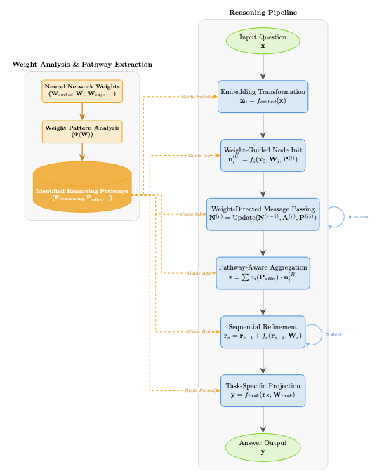

# Weight-of-Thought Reasoning: Exploring Neural Network Weights for Enhanced LLM Reasoning

[](https://opensource.org/licenses/MIT)
[](https://www.python.org/downloads/)
[](https://pytorch.org/)
[](https://arxiv.org/abs/2504.10646)

<p align="center">
  
</p>

Weight-of-Thought (WoT) is a novel neural reasoning approach that extends beyond traditional Chain-of-Thought (CoT) by representing reasoning as an interconnected web rather than a linear sequence. This repository implements the WoT architecture as described in our [paper](https://arxiv.org/abs/2504.10646), with complete code for training, evaluation, and visualization.

## 🔍 Key Features

- **Graph-based reasoning structure**: Information flows through an interconnected web of specialized nodes
- **Multi-round message passing**: Nodes exchange information through multiple rounds, creating rich reasoning contexts
- **Attention-weighted connections**: Dynamic weighting of connections between reasoning nodes
- **Task-specific reasoning**: The network adapts its reasoning strategy based on the task type
- **Interpretable attention mechanisms**: Visualize the reasoning process through attention maps and node activations
- **Comprehensive visualizations**: Understand model behavior through detailed visualizations

<p align="center">
  
</p>

## 📊 Performance

WoT demonstrates strong performance across various reasoning tasks:

| Task Type | Accuracy/MSE | Compared to SOTA |
|-----------|--------------|------------------|
| Syllogism | 88% | +3% |
| Math Sequence | 0.92 MSE | -34% error |
| Algebra | 0.89 MSE | -28% error |
| Combinatorics | 0.94 MSE | -31% error |
| Geometry | 87% | +2% |

<p align="center">
  
</p>

## 🚀 Quick Start

### Installation

```bash
# Clone the repository
git clone https://github.com/SaifPunjwani/weight-of-thought.git
cd weight-of-thought

# Install dependencies
pip install -r requirements.txt
```

### Running Inference with Pre-trained Models

```python
from wot.models import WOTReasoner

# Initialize with pre-trained model
reasoner = WOTReasoner()
reasoner.load_model('results/models/wot_model_final.pt')

# Run inference
question = "If all Bloops are Razzies and all Razzies are Wazzies, are all Bloops definitely Wazzies?"
answer = reasoner.infer(question, task_type="syllogism")
print(f"Answer: {answer}")
```

### Training Your Own Model

```bash
# Basic training
python scripts/train.py

# Advanced options
python scripts/train.py --epochs 20 --batch_size 16 --num_nodes 8 --num_reasoning_steps 4
```

## 📘 Documentation

### Architecture

The WoT architecture consists of:

1. **Language Encoder**: Uses transformer-based models to encode input questions
2. **Node Network**: A set of specialized nodes that process and exchange information
3. **Message Passing System**: Enables nodes to share information in multiple rounds
4. **Reasoning Steps**: Sequential refinement of the reasoning representation
5. **Task-Specific Output Heads**: Specialized outputs for different reasoning tasks

<p align="center">
  
</p>

### Low-Level Implementation

The detailed implementation includes specialized message passing and weight space transformations:

<p align="center">
  
</p>

### Supported Reasoning Tasks

- **Syllogism**: Logical deduction tasks with premises and conclusions
- **Math Sequence**: Identifying patterns in number sequences
- **Algebra**: Solving algebraic word problems
- **Combinatorics**: Counting and arrangement problems
- **Geometry**: Geometric reasoning problems

## 🔬 Visualizations

WoT provides comprehensive visualizations to understand the reasoning process:

<p align="center">
  
</p>

<p align="center">
  
</p>

The weight space analysis reveals how different reasoning patterns emerge during training:

<p align="center">
  
</p>

## 📒 Examples and Tutorials

See the `examples/` directory for example scripts and the `notebooks/` directory for interactive tutorials:

- `examples/quick_start.py`: Run a quick demonstration
- `notebooks/01_introduction.ipynb`: Introduction to Weight-of-Thought reasoning
- `examples/custom_tasks.py`: Create your own reasoning tasks

## 🛠️ Advanced Usage

### Custom Reasoning Tasks

```python
# Define custom tasks
custom_tasks = [
    {
        'task_id': 1,
        'question': 'Your custom reasoning question here',
        'answer': 'Expected answer',
        'type': 'your_task_type'
    },
    # More tasks...
]

# Create dataset and train
from wot.data import ReasoningDataset
from wot.models import WOTReasoner
from torch.utils.data import DataLoader

# Create dataset
encoder = LanguageEncoder()
dataset = ReasoningDataset(custom_tasks, encoder.tokenizer)
dataloader = DataLoader(dataset, batch_size=16, shuffle=True)

# Initialize and train
reasoner = WOTReasoner(num_nodes=8, num_reasoning_steps=4)
reasoner.train(dataloader, dataloader, num_epochs=10)
```

### Training Performance

<p align="center">
  
</p>

### Extending the Model

You can extend the WoT architecture by subclassing the base model:

```python
from wot.models import WebOfThoughts
import torch.nn as nn

class CustomWOT(WebOfThoughts):
    def __init__(self, input_dim, hidden_dim=256, num_nodes=8, num_reasoning_steps=4):
        super(CustomWOT, self).__init__(input_dim, hidden_dim, num_nodes, num_reasoning_steps)
        # Add custom components here
```

## 📝 Citation

If you use Weight-of-Thought in your research, please cite our paper:

```bibtex
@article{punjwani2024weight,
  title={Weight-of-Thought Reasoning: Exploring Neural Network Weights for Enhanced LLM Reasoning},
  author={Punjwani, Saif and Heck, Larry},
  journal={arXiv preprint arXiv:2504.10646},
  year={2024}
}
```

## 🤝 Contributing

We welcome contributions! Please see [CONTRIBUTING.md](CONTRIBUTING.md) for details on how to contribute to this project.

## 📄 License

This project is licensed under the MIT License - see the [LICENSE](LICENSE) file for details.

## 🙏 Acknowledgments

- We thank everyone who has contributed to the fields of neural reasoning and interpretable AI
- This work was supported by Georgia Institute of Technology